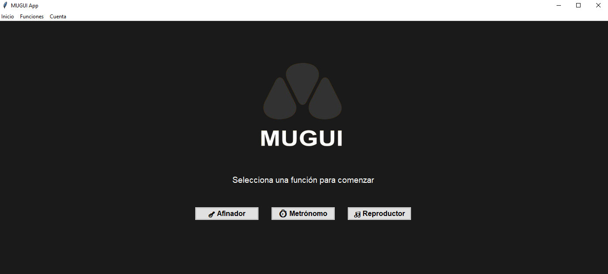
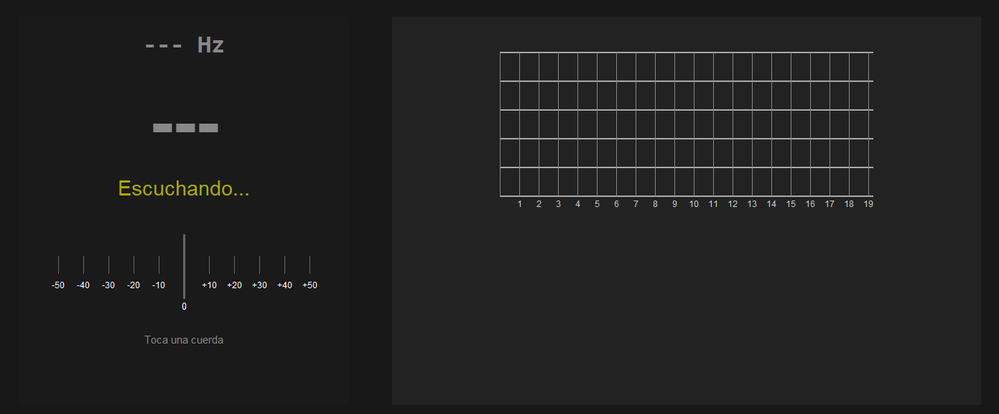
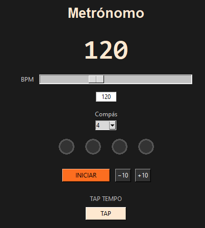
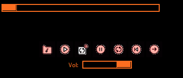
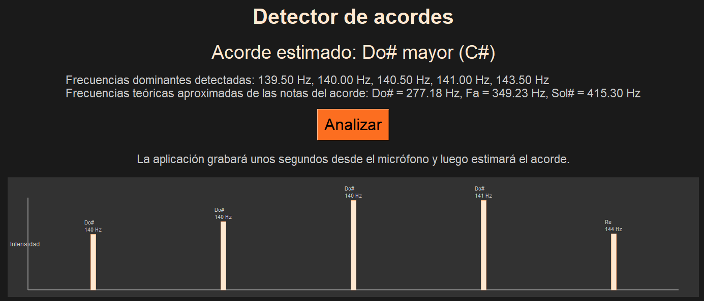

# Video explicativo
[Video MUGUI](https://youtu.be/2amNoKBj0Cw)

# MUGUI

Esta aplicación te proporciona cuatro herramientas esenciales para practicar música:

- **Afinador** - Afina tu guitarra con precisión
- **Metrónomo** - Mantén el ritmo mientras practicas
- **Reproductor** - Escucha tu música favorita mientras practicas
- **Detector de Acordes** - Identifica automáticamente los acordes que tocas


## Primeros Pasos

### Instalación Rápida

1. **Descargar e instalar Python**
   - Asegúrate de tener Python 3.13 o superior
   - Descárgalo desde www.python.org

2. **Instalar dependencias**
   ```bash
   pip install -r requirements.txt
   ```

3. **Iniciar la aplicación**
   ```bash
   python MUGUI.py
   ```


## Interfaz Principal

Una vez cargada la aplicación, verás la pantalla principal con cuatro elementos:

### Menú de Navegación


En la pantalla inicial tienes acceso a los cuatro módulos:
- **Afinador** - Abre el módulo de afinación
- **Metronomo** - Abre el módulo de metrónomo
- **Acordes** - Abre el detector de acordes
- **Reproductor** - Abre el módulo de reproductor

También puedes usar el menú superior:
- **Inicio** → Menú Principal (vuelve a esta pantalla)
- **Funciones** → Selecciona cualquier módulo
- **Cuenta** → Gestiona tu sesión de usuario (opcional)

---

## Módulo de Afinación (Tuner)

### ¿Cómo Funciona?

El afinador detecta automáticamente las notas que tocas en tu guitarra. Funciona analizando el sonido del micrófono en tiempo real.

### Requisitos

- Micrófono conectado al equipo
- Guitarra u otro instrumento para afinar
- Lugar sin ruido de fondo

### Cómo Usar




**Afina**
1. Toca una cuerda de tu guitarra
2. Mira la pantalla:
   - **Frecuencia (Hz)** - Número en la parte superior derecha
   - **Nota Musical** - La nota que está detectando (E, A, D, G, B, E)
   - **Desviación en cent** - Cuánto desafinada está la nota
      > Un **cent** es 1/100 de un semitono. Esto significa:
      >- ±5 cents es imperceptible al oído
      >- ±10 cents es una afinación buena
      >- ±20 cents comienza a sonar desafinado


**Paso 3: Ajusta la Tensión**
1. Si la nota está demasiado baja: aprieta la clavija (sube la afinación)
2. Si la nota está demasiado alta: afloja la clavija (baja la afinación)
3. Observa el cambio en tiempo real


### Notas Válidas para Guitarra

| Cuerda | Nota Estándar | Frecuencia (Hz) |
|--------|---------------|-----------------|
| 6 (más grave) | E (Mi) | ~82.4 |
| 5 | A (La) | ~110 |
| 4 | D (Re) | ~146.8 |
| 3 | G (Sol) | ~196 |
| 2 | B (Si) | ~246.9 |
| 1 (más aguda) | E (Mi) | ~329.6 |

---

## Módulo de Metrónomo

### ¿Cómo Funciona?

El metrónomo genera pulsos de audio sincronizados para ayudarte a mantener el ritmo mientras practicas.

### Cómo Usar



1. Presiona **INICIAR** para comenzar
2. El metrónomo emitirá sonidos de pulso
3. Practica manteniendo el ritmo
4. Presiona **PAUSA** para detener en cualquier momento

### Calibración Manual (Tap Tempo)

Si no sabes qué BPM usar, puedes calibrar el tempo:


1. Presiona **TAP** repetidamente al ritmo que deseas
2. El metrónomo detectará automáticamente el BPM
3. Mínimo 3 toques para calibrar


---

## Módulo de Reproductor

### ¿Cómo Funciona?

El reproductor te permite escuchar archivos MP3 mientras practicas con el afinador o metrónomo.

### Requisitos

- Archivos en formato MP3
- Altavoces o auriculares conectados

### Cómo Usar



**Paso 1: Agregar Canciones**

1. Haz clic en el **botón de carpeta** (📁)
2. Se abrirá el explorador de archivos
3. Selecciona uno o más archivos MP3
4. Los archivos aparecerán en la lista


**Paso 2: Reproducir**

1. Haz clic en una canción de la lista para seleccionarla
2. Presiona  ▶ para comenzar
3. La canción se reproducirá en los altavoces


---

## Módulo de Detector de Acordes



El detector de acordes analiza el sonido en tiempo real y muestra automáticamente qué acorde estás tocando. Funciona detectando las frecuencias presentes en el audio y comparándolas con patrones de acordes conocidos.


### Instalación Completa

**1. Clonar el repositorio:**
```bash
git clone https://github.com/jolayac/Proyecto-POO-MUGUI.git
cd Proyecto-POO-MUGUI
```

**3. Instalar dependencias:**
```bash
pip install -r requirements.txt
```

**4. Ejecutar:**
```bash
python MUGUI.py
```


### Arquitectura del Proyecto

```
Proyecto-POO-MUGUI/
├── MUGUI.py              # Punto de entrada
├── MainApp.py                 # Orquestador principal
├── mvvm/
│   ├── Model/                 # Lógica de negocio
│   │   ├── AudioProcessor.py
│   │   ├── PitchAnalyzer.py
│   │   ├── MetronomeModel.py
│   │   ├── firebase_admin.py
│   │   └── reproductorModel/
│   │       ├── reproductor.py
│   │       └── pista.py
│   ├── View/                  # Interfaz gráfica
│   │   ├── FrameManager.py
│   │   ├── MenuManager.py
│   │   ├── AuthenticationView.py
│   │   ├── menu.py
│   │   ├── TunerGUI.py
│   │   ├── metronomo.py
│   │   ├── chords.py    
│   │   ├── reproductorFrame.py
│   │   ├── afinador/          
│   │   │   ├── Fretboard.py
│   │   │   └── TunerCalibrator.py
│   │   └── reproductorView/
│   │       ├── reproductorUI.py
│   │       └── barra_de_tiempo.py
│   └── ViewModel/             # Coordinación
│       ├── FrameNavigationViewModel.py
│       ├── MenuViewModel.py
│       ├── TunerApp.py
│       ├── MetronomeVM.py
│       ├── reproductor_vm.py
│       ├── authentication_vm.py
│       └── chords_vm.py 
│       └── reproductor_vm.py
├── sonidos/
│   ├── tic.wav
│   └── tac.wav
└── imagenes/
    └── [recursos gráficos]
```


### Configuración Avanzada

**Cambiar dispositivo de micrófono:**

1. Abre `mvvm/Model/AudioProcessor.py`
2. Busca `device_index = None`
3. Cambia None por el número de tu dispositivo

**Listar dispositivos disponibles:**
```bash
python -c "import pyaudio; p = pyaudio.PyAudio(); [print(i, p.get_device_info_by_index(i)['name']) for i in range(p.get_device_count())]"
```

**Ajustar sensibilidad de micrófono:**

En `AudioProcessor.py`, modifica:
```python
self.MIN_ENERGY = 0.00004  # Mayor valor = menos sensible
```

**Cambiar rango de detección:**

En `PitchAnalyzer.py`, modifica:
```python
fmin=30,     # Frecuencia mínima (Hz)
fmax=1318,   # Frecuencia máxima (Hz)
```

## Información de cuentas

Para manejar las opciones de inicio de seción y registrar, se tiene que crear un archivo .env con las siguientes variables:
Para habilitar el inicio de sesión y registro de usuarios, debes crear un archivo `.env` en la raíz del proyecto con las siguientes variables:

```
client_id=TU_CLIENT_ID
client_secret=TU_CLIENT_SECRET
```

**¿Cómo obtener estos datos?**
1. Ingresa a [Google Cloud Console](https://console.cloud.google.com/)
2. Desde tu proyecto (crea uno si aun no lo tienes), ve a "APIs y servicios" → "Credenciales"
3. Crea un nuevo ID de cliente OAuth 2.0 (tipo: aplicación de escritorio)
4. Copia el `client_id` y el `client_secret` que te proporciona Google
5. Pégalos en el archivo `.env` como se muestra arriba


Con esto podrás utilizar las funciones de inicio de sesión y registro en la aplicación.

---
# Colaboradores 
- Juan Sebastián Olaya Castañeda 
- Juan Camilo Paez Guaspud 